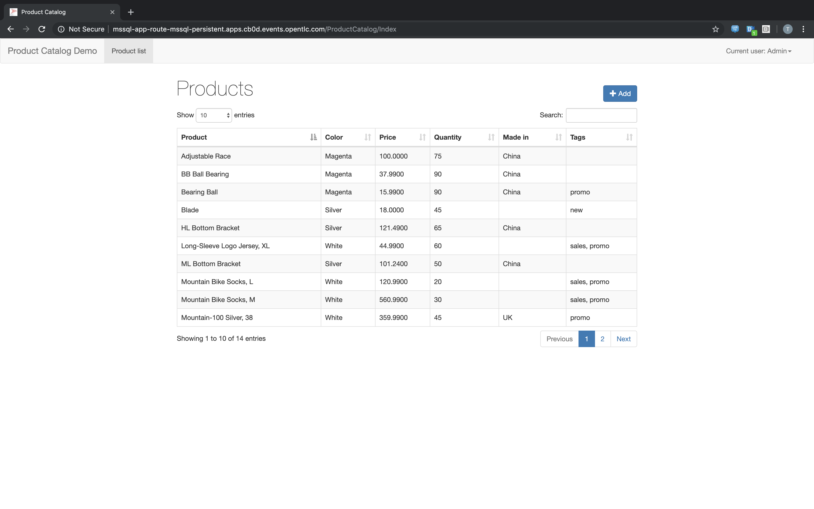
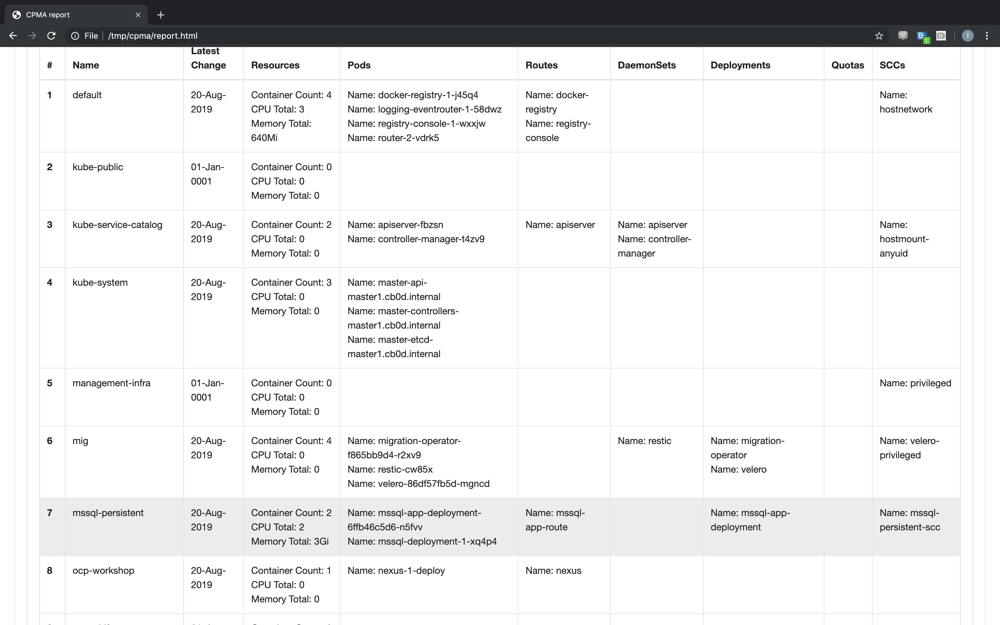

# 5.0 Migrate MSSQL Application

The first application that we are going to migrate is a simple Product Inventory web-based application front-end, backed backed by Microsoft SQL Server.  This application has been pre-deployed on your 3.11 cluster in the mssql-persistent namespace, using a single PV backed by NFS for persistent storage.

If we login to 3.11 cluster, we can see the app running:

```bash
$ oc get pods -n mssql-persistent
NAME                                    READY   STATUS    RESTARTS   AGE
mssql-app-deployment-6ffb46c5d6-n5fvv   1/1     Running   0          41m
mssql-deployment-1-xq4p4                1/1     Running   0          41m
```

Let's get the route to the application, and bring up the webUI.

```bash
$  oc get route -n mssql-persistent
NAME              HOST/PORT                                                       PATH   SERVICES     PORT   TERMINATION   WILDCARD
mssql-app-route   mssql-app-route-mssql-persistent.apps.cd76.events.opentlc.com          db-app-svc   5000                 None
```



Let's go ahead and add a new product to the inventory.  Click on the +Add button and enter some data.


You can see the application is functioning and state is being saved in the DB.  


## 5.1 Migration Planning with CPMA

In planning our migration, the first step is to check out the CPMA generated report that we created and downloaded in Lab 3.

1. Point your browser to `File:///tmp/cpma/report.html`.

2. Open the `Cluster report` section of the report and click on `Namespaces`.

3. Scroll down until you see the entry for `mssql-persistent`.



We see lots of detailed information about the mssql application and deployment, including the use of a custom Security Context Constraint (SCC).  We know from our CAM overview, that SCCs are not migrated as part of a Migration Plan.  So, we will need to apply the custom SCC onto our 4.1 Cluster prior to migrating the application.

Let's do this now.  The custom SCC yaml is available [here](./files/mssql-scc.yaml).  Please download to your local machine, as we will apply it in the next step.

### 5.1.1 Create MSSQL Security Context Constraint

1. Run the following to recreate MSSQL's `scc` on the destination cluster:
```bash
$ oc create -f files/mssql-scc.yaml
```

## 5.2 Using CAM

Next, let's open up the migration UI. Again, to get the route, run the following command on the destination cluster:
```bash
$ oc get routes migration -n mig -o jsonpath='{.spec.host}'
migration-mig.apps.cluster-dymurray-ocp4.dymurray-ocp4.mg.example.com
```

The screen should look something like:


### 5.2.1 Add a Cluster

First thing we want to do is add the source OCP cluster we wish to migrate the
application from. Click `Add cluster`:


Fill out the neccessary information. Be sure to see the [Setup
Document](./Setup.md#source-cluster) to get the service account token and URL.


When done, click `Check connection`. You should see a `Success!` message. Click
`Add`.


## Setup an AWS S3 bucket as a replication repository

Next we want to add a replication repository. Click `Add Repository`:


Fill out the AWS S3 bucket credential information.


Click `Check connection` and you should see a `Success!` message appear if
everything looks good.


Click `Add` and view your repository on the main menu. Now that we have a
replication repository specified and both the source and destination clusters
defined, we can create a migration plan. Click `Add Plan`:


## (Optional) View the application you wish to migrate

* Mediawiki


* MSSQL


## Create a migration plan

Now that we have a replication repository specified and both the source and
destination clusters defined, we can create a migration plan. Click `Add Plan`:


Fill out a plan name:


Select the source cluster name:


Select the namespace(s) you wish to migrate over. This will be either
`mssql-persistent` or `mediawiki`:


Now we are displayed a list of persistent volumes associated with our
application workload. Select which type of action you would like to perform on
the PV. For this example, let's select `copy`:


Select your migration targets. Select the previously created replication
repository and leave the target cluster field as `host`. Optionally change the
name of the namespace you wish to have on the destination cluster.


After validating the migration plan, you will see a `Ready` message and you can
click `Close`:


## Migrate the application workload

Now we can select `Migrate` or `Stage` on the application. Since we don't care
about downtime for this example, let's select `Migrate`:


Optionally choose to *not* terminate the application on the source cluster.
Leave it unchecked and select `Migrate`.


Once done, you should see `Migration Succeeded` on the migration plan:


## Verify application is functioning on destination cluster

Let's first open the OCP 4.1 web console:


Click on the `mssql-persistent` or `mediawiki` namespace:


Click on the `mssql-app-deployment` or `mediawiki` deployment object to
retrieve the route:


Open the route and verify the application is functional:

* MSSQL


* Mediawiki


## Bonus: Check out copied PV

To verify the application actually copied the PV data over to a new volume,
let's confirm we are no longer using an NFS volume. If everything worked as
expected, our OCP 4.1 cluster will use it's default storage class (gp2) to
provision an AWS EBS volume.

Click on the `Storage` tab in the web console:


Click on the persistent volume and verify that it is using Amazon Elastic Block
Storage as the provisioner:


Next Lab: [Lab 6 - Migrate Robot Shop Application](./6.md)<br>
[Home](./README.md)
