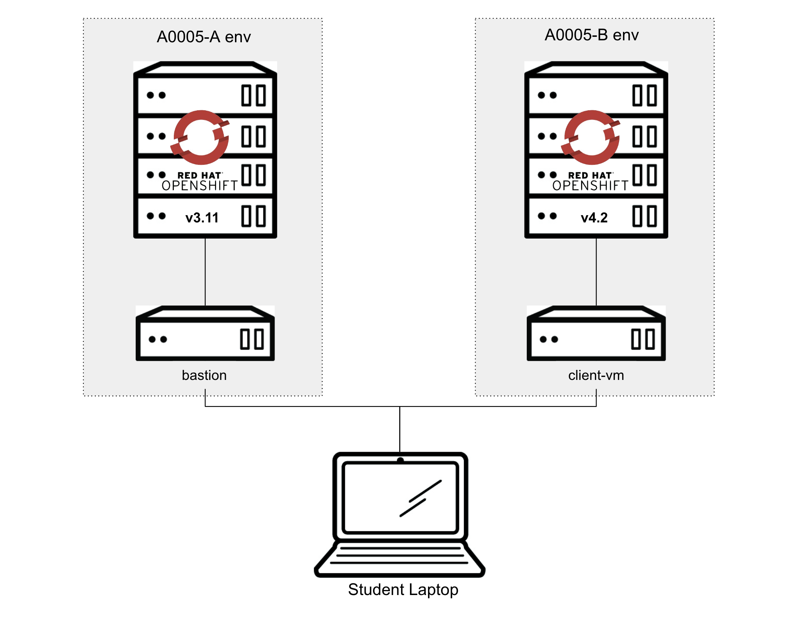

# Accessing to the Lab Environment

## Getting your dedicated lab environments using Guid Grabber

On your laptop, open **TWO** browser tabs to [*Lab GUID Assignment page*](https://www.opentlc.com/gg/gg.cgi?profile=generic_tester).

From this page, you will be assigned your unique GUID, which you will use to access your unique lab environment and systems.

For this lab you will need two different environments (v3.11 and v4.2), pay attention while selecting the *Lab Code* from the drop down list.

**You are not required to login anywhere at this point, in this intro lab you will only get the information related to your assigned lab environments.**

### Getting 3.11 Cluster Environment - Browser Tab 1

From the drop down list:

1. Choose the lab `A0005-A - OpenShift Cluster Application Migration (CAM) Lab`
2. Enter the activation key shared by the instructors
3. Enter your email address
4. Click submit
5. Save the information on screen

e.g:

The resulting *Lab Information page* will display your lab's GUID and other useful information about your lab environment.
Take note of your assigned GUID.

You will use this GUID to access your lab's environment and systems.
Your unique GUID will also be embedded in your lab environment's host names.

**Be sure to note that this GUID is for your v3.11 environment.**

### Getting 4.2 Cluster Environment - Browser Tab 2

From the drop down list:

1. Choose the lab `A0005-B - OpenShift Cluster Application Migration (CAM) Lab`
2. Enter the activation key shared by the instructors
3. Enter your email address
4. Click submit
5. Save the information on screen

**Be sure to note that this GUID is for your v4.2 environment.**

## Lab Environment Overview

Next Lab: [Lab 1 - Introduction and Prerequisites](./1.md) 
[Home](../README.md)
